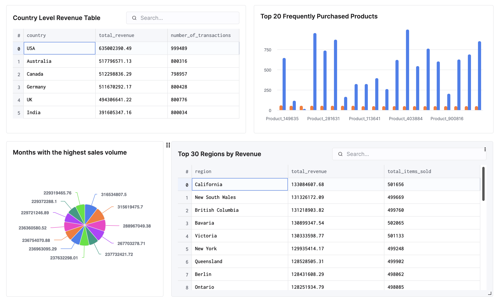

## Choices I made

- I picked ClickHouse as the database as the task is to mainly analyze data. Since ClickHouse is a column-oriented OLAP database it is ideal for the usecase.

- I partitioned the database using ```transaction_date``` to improve the query performace as there were 5M records in the given dataset.

- Also I have defined a sort order like ```transaction_date, country, region, product_name```. It makes it easy to aggregate associated values, for example, with this sort order, total prices for same country laid out as a continuous set of values in the disk.

- Consider using ```LowCardinality(String)``` for ```country```, ```region```, and ```product_name``` to save space and speed up group-by queries.

```sql
CREATE TABLE transactions (
    transaction_id String,
    transaction_date Date,
    user_id String,
    country LowCardinality(String),
    region LowCardinality(String),
    product_id String,
    product_name LowCardinality(String),
    category LowCardinality(String),
    price Decimal(10, 2),
    quantity UInt16,
    total_price Decimal(12, 2),
    stock_quantity UInt16,
    added_date Date
)
ENGINE = MergeTree
PARTITION BY toYYYYMM(transaction_date)
ORDER BY (transaction_date, country, region, product_name)
```

## Steps I followed

- Came up with a Golang script to parse the ```CSV``` file batch wise and store into the ClickHouse's ```transactions``` table as depicted in above schema.

- Then I wrote the following queries to address each dashboard element:

### Country-Level Revenue Table

```sql
SELECT
    country,
    sum(total_price) AS total_revenue,
    count() AS number_of_transactions
FROM
    transactions
GROUP BY
    country
ORDER BY
    total_revenue DESC;
```


### Top 20 Frequently Purchased Products

```sql
SELECT
    product_name,
    sum(quantity) AS total_quantity_purchased,
    anyLast(stock_quantity) AS current_stock_quantity
FROM
    transactions
GROUP BY
    product_name
ORDER BY
    total_quantity_purchased DESC
LIMIT
    20;
```

### Months with the highest sales volume

```sql
SELECT
    formatDateTime(transaction_date, '%M') AS month_name,
    sum(total_price) AS total_revenue
FROM
    transactions
GROUP BY
    month_name
ORDER BY
    total_revenue DESC;
```

### Top 30 Regions by Revenue

```sql
SELECT
    region,
    sum(total_price) AS total_revenue,
    sum(quantity) AS total_items_sold
FROM
    transactions
GROUP BY
    region
ORDER BY
    total_revenue DESC
LIMIT
    30;
```

- Created a dashboard for each query in ClickHouse which looks like below:



## Demo video

- [See the the Demo Video](https://youtu.be/2ox9AY2hVXw)


## Meets the performance criteria

- According to the query results in the demo, each query takes no more than a half of a second.
